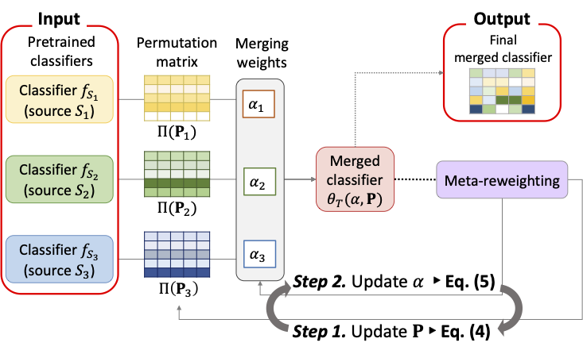

# Accurate Source-Free Speech Classification via Meta-Learned Target-Centric Model Merging

This repository is the official implementation of **MOCHEE: Accurate Source-Free Speech Classification via Meta-Learned Target-Centric Model Merging** accepted at **Interspeech 2026**.




## Requirements

We recommend using the following versions of packages:

* python==3.9
* torch>=2.0
* torchaudio
* transformers
* numpy
* scikit-learn
* scipy
* pandas
* tqdm

## Code Structure

* `main.py`
  Entry script for model merging and evaluation.

* `src/data.py`
  Loads pretrained source classifiers and target feature caches.

* `src/merge.py`
  Implements permutation alignment and meta-learned source weighting.

* `src/train.py`
  Target-domain evaluation.

* `src/utils.py`
  Utility functions, including seed control and parameter handling.

## How to Run

You can run MOCHEE with the following command:

```bash
python main.py \
  --target <target_dataset> \
  --sources <source1> <source2> ... \
  --seeds 1 4 7 \
  --tgt_val_ratio 0.05 \
  --tgt_test_ratio 0.9 \
  --device cuda:0
```

Main arguments:

* `--target`: target dataset name
* `--sources`: list of pretrained source classifiers
* `--seeds`: random seeds
* `--lr`: learning rate
* `--tgt_val_ratio`: ratio of labeled target validation data
* `--tgt_test_ratio`: ratio of target test data
* `--device`: device for running experiments

## Notes

* This implementation assumes that source-domain data are unavailable.
* Only pretrained source classifiers and limited labeled target-domain data are used.
* Evaluation reports accuracy and macro-F1.

## Reference

If you use this code, please cite the following paper.

```bibtex
@inproceedings{Park26MOCHEE,
  author    = {Ka Hyun Park, Junghun Kim, and U Kang},
  title     = {Accurate Source-Free Speech Classification via Meta-Learned Target-Centric Model Merging},
  booktitle = {Interspeech},
  year      = {2026}
}
```
